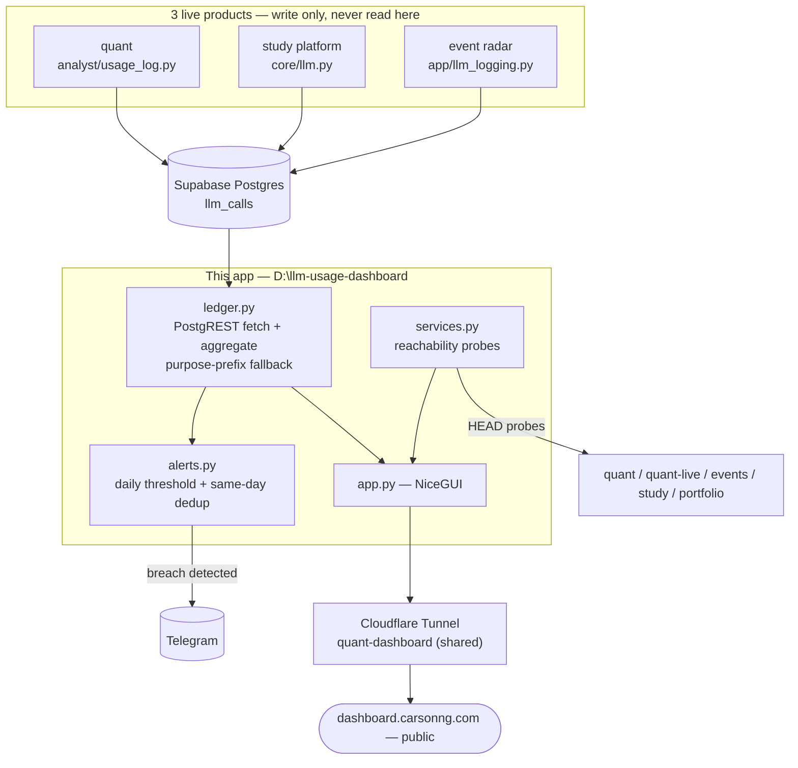

# LLM Usage Dashboard

A personal FinOps dashboard for three live AI products (a trading system, an event-discovery app, and an exam-prep RAG platform) that all draw on the same shared, quota-limited LLM key. Turns a Supabase table nobody was looking at into cost visibility, alerting, and a status page for the whole personal stack.

**Live:** [dashboard.carsonng.com](https://dashboard.carsonng.com)

Built as both a genuinely-used personal tool and a demonstration of the kind of judgment an AI PM/governance role actually needs: verify before trusting existing code, prefer removing a failure point over patching around it, and be honest about what a number actually means before putting it in front of anyone.

---

## What makes this more than a metrics page

- **Found a production dependency that had been silently dead for 12 days, before writing a single line of the fix.** This dashboard already existed — built once, then apparently never checked again. Its data path called a companion Supabase Edge Function; that function returned a plain HTTP 404. Rather than assume the plan ("wire up alerting on top of what's there") was still valid, the first step was `curl`-ing the endpoint directly to confirm it was actually broken, then tracing why (never deployed — no Supabase CLI on this machine, no deploy history). Building on unverified assumptions about "already working" code is exactly the failure mode that lets a broken system look fine for 12 days.
- **Chose to remove the failure point, not patch it.** The fix on offer was "just deploy the Edge Function." Instead, the Edge Function layer was dropped entirely — the dashboard now queries the shared `llm_calls` table directly over PostgREST and aggregates in Python. At this data volume (~1,400 rows), a second deployable added latency, an extra piece of infrastructure to keep working, and — as just proven — a silent single point of failure, for zero benefit over doing the same aggregation in the same process that already needed an HTTP client.
- **The headline cost number comes with an honest asterisk, not a false precision.** Every project's `cost_usd` is computed from a hardcoded reference price table applied to real token counts — not a real invoice. All three products are routed through a free-tier proxy, so the actual amount billed is often zero. The dashboard treats this correctly: a **relative cost-trend signal** for comparing projects/models/providers, not a number to report as real spend. Getting this distinction right — and saying so — is the difference between a useful internal metric and a misleading one.
- **Attribution stays correct even though the data is inconsistent by design.** Only one of the three writing projects populates the `project`/`provider` columns that actually exist on the table; the other two only ever wrote a `purpose` string like `"quant:board_scan"`. Every aggregation here preserves the original prefix-parsing fallback so cost still attributes to the right project — a naive rewrite that only trusted the "real" columns would have silently misattributed the majority of current spend to `(untagged)`.
- **Alerting was verified to actually reach a phone, not just verified to compile.** The Telegram push reuses the same bot/chat and message convention already proven in production (the trading system's own risk alerts), and was confirmed with a real one-off test message before being called done — "the code looks right" and "the notification arrives" are different claims, and only the second one matters for an alert.
- **Background delivery works with zero browser tabs open.** A cost alert that only fires while someone happens to be looking at the dashboard isn't an alert. Ran into (and worked around) a real constraint in the installed NiceGUI version that rejects a bare global-scope timer — solved with an `asyncio` task registered on app startup instead, so the threshold check and Telegram push run on a schedule independent of any connected client.
- **Reused existing infrastructure instead of building new.** Getting this onto the public internet at `dashboard.carsonng.com` took one new ingress line in an *already-running* Cloudflare Tunnel shared by three other subdomains, plus one DNS route command — not a second tunnel, not a new deployment story to maintain.
- **The "My Services" status strip tells the truth about what "down" means.** Two of the linked services sit behind a Cloudflare Access login; a healthy instance still responds to a probe with a redirect to that login page, not a 200. The health check treats *any* response as "up" and only a connection failure as "down" — a naive `status_code == 200` check would falsely flag two healthy, Access-protected services as broken.

## Architecture



**The loop that ties it together:** the three products write independently and never know this dashboard exists → `ledger.py` reads the shared table and normalizes attribution across two different write conventions → `alerts.py` watches the same data for a threshold breach and pushes to Telegram without needing anyone to have the page open → `services.py` gives the same page a one-glance answer to "is everything actually up" for the rest of the personal stack.

## Tech stack

| Layer | Choice | Why |
|---|---|---|
| Data access | Direct PostgREST (`httpx` + Supabase service-role key) | Removed an Edge Function middle layer that had silently failed; at ~1,400 rows, aggregating in the same process is simpler and has one fewer thing to deploy |
| UI | NiceGUI + ECharts | Already the house style across the other three products — one less framework to context-switch between |
| Alerting | Telegram Bot API, reusing existing bot/chat | No new notification channel to configure or forget about |
| Deployment | Cloudflare Tunnel (shared with 3 other subdomains) | One tunnel, one watchdog, one thing to keep alive — not a fourth |

## Project structure

```
D:\llm-usage-dashboard/
  app.py          NiceGUI page: services strip, alert banner, KPIs, charts, call-type table
  ledger.py        llm_calls fetch + aggregation, purpose-prefix fallback, insight generation
  alerts.py        Daily cost threshold, file-backed same-day dedup, Telegram push
  services.py      Static service registry + HTTP reachability probes
  .env.example     Required/optional environment variables
```

## Running locally

```bash
python -m venv .venv && .venv\Scripts\activate       # Windows
pip install -r requirements.txt
cp .env.example .env                                  # fill in SUPABASE_URL / SUPABASE_SERVICE_ROLE_KEY
python app.py                                          # http://localhost:8095
```

`TELEGRAM_BOT_TOKEN` / `TELEGRAM_CHAT_ID` are optional — the alert banner still works without them, just no push notification.

## Changelog

Newest first. Each entry is what shipped plus the reasoning behind it — not just a diff summary.

### 2026-07-28 (later) — public ops hub
- **Extended into a personal ops hub at `dashboard.carsonng.com`.** Added a "My Services" strip linking out to the other three products plus the portfolio site, each with a live reachability status dot (see the Access-redirect note above). Exposed publicly by adding one ingress rule to the Cloudflare Tunnel already serving those three products, rather than standing up a second tunnel — verified live with a direct `curl` and a browser check against the real public URL after restarting the shared tunnel process.
- **Chose fully public over Access-gated,** matching `events.carsonng.com`'s exposure level rather than the trading dashboard's — this page shows relative cost trends, not anything that needs gating.

### 2026-07-28 — cost dashboard fix, alerting, insights
- **Diagnosed and fixed a dashboard that had never worked.** Traced a 404 on the Edge Function this app depended on back to a deploy that most likely never happened, then removed that dependency entirely rather than fixing the deploy — see above.
- **Added a daily cost-threshold alert with Telegram push**, reusing the trading system's existing bot/chat and message format so a cost alert reads consistently next to its other alerts in the same chat. Verified the send actually lands, not just that the function runs without raising.
- **Added an auto-generated "top spender" insight line and a projected-monthly-cost KPI** — the actual point of a FinOps view (what should I look at first) rather than raw charts alone.
- Worked around a NiceGUI version constraint (`ui.page cannot be used ... when UI is defined in the global scope`) by moving the periodic background check to an `app.on_startup`-registered `asyncio` task instead of a bare `ui.timer`.

### 2026-07-16 — initial build
- First version: KPI cards, daily calls trend, by-project/by-provider/by-model/by-environment breakdowns, call-type table, date-range toggle — reading from the Edge Function later found to be non-functional.

## Roadmap

- Quant and event_radar's own logging code never populate the `project`/`provider` columns that exist on the shared table (only the study platform does) — their spend currently shows as `(untagged)` in the by-provider breakdown. Flagged as a follow-up task against those two codebases rather than worked around here, since the fix belongs in their write paths, not in this reader.
- Configurable monthly budget (today's projection derives an implied monthly budget from the daily alert threshold × 30, which is a reasonable proxy but not an independently-set figure).
