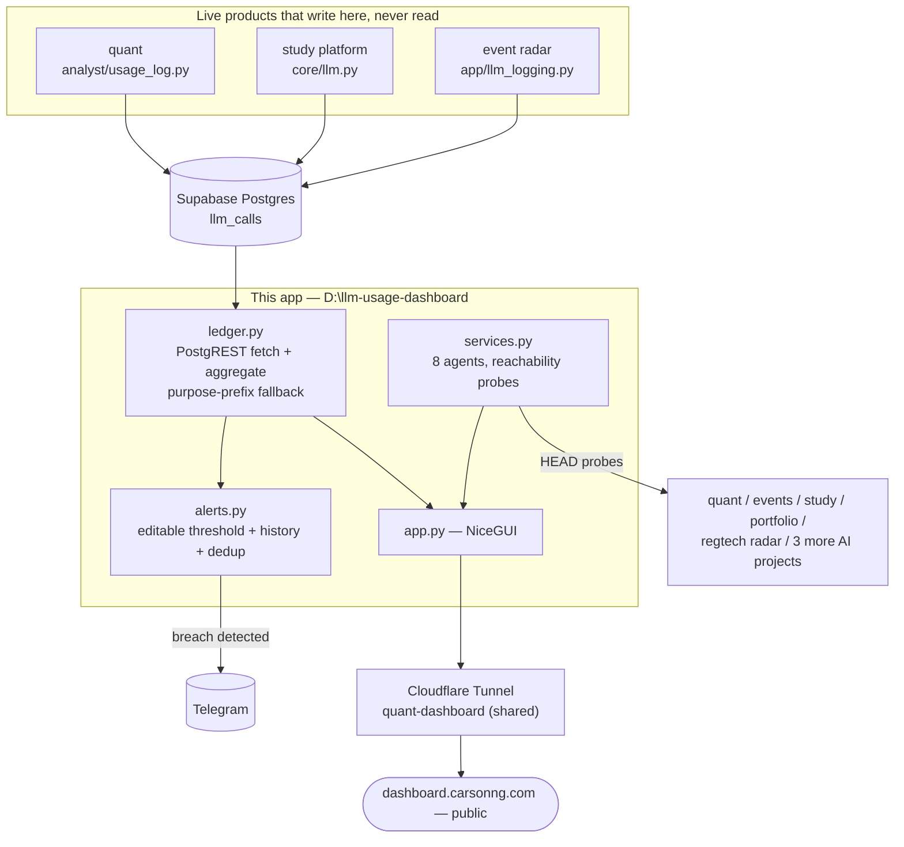

# Command Deck

A personal FinOps + ops hub for a small portfolio of live AI products (a trading system, an event-discovery app, an exam-prep RAG platform, and a RegTech compliance tracker) that share a single quota-limited LLM key, plus at-a-glance links to a handful of other shipped AI-engineering projects. Turns a Supabase table nobody was looking at into cost visibility, alerting, and a status page for the whole personal stack. Renamed from "Personal SaaS Cost Dashboard" (2026-08-15) once it started tracking uptime and restarting containers, not just totalling API bills.

**Live:** [dashboard.carsonng.com](https://dashboard.carsonng.com)

A genuinely-used personal tool, not a demo — the design choices throughout favor verifying before trusting existing code, removing a failure point instead of patching around it, and being honest about what a number actually means before putting it in front of anyone.

---

## Architecture



**The loop that ties it together:** the writing products never know this dashboard exists → `ledger.py` reads the shared table and normalizes attribution across inconsistent write conventions → `alerts.py` watches the same data for a threshold breach (itself dashboard-editable) and pushes to Telegram without needing anyone to have the page open → `services.py` gives the same page a one-glance answer to "is everything actually up" for the rest of the personal stack, cost-tracked or not.

## Tech stack

| Layer | Choice | Why |
|---|---|---|
| Data access | Direct PostgREST (`httpx` + Supabase service-role key) | Removed an Edge Function middle layer that had silently failed; at ~1,400 rows, aggregating in the same process is simpler and has one fewer thing to deploy |
| UI | NiceGUI + ECharts, dark-mode aware | Already the house style across the other products — one less framework to context-switch between |
| Alerting | Telegram Bot API, reusing existing bot/chat | No new notification channel to configure or forget about |
| Settings | Flat JSON files, gitignored | The alert threshold and dedup state need to survive a process restart, not a database — a file is the right amount of infrastructure for one number |
| Deployment | Cloudflare Tunnel (shared with other subdomains) | One tunnel, one watchdog, one thing to keep alive |

## Project structure

```
D:\llm-usage-dashboard/
  app.py          NiceGUI page: agents strip, alert banner, KPIs, charts, tables, CSV export
  ledger.py        llm_calls fetch + aggregation, purpose-prefix fallback, efficiency/latency
                    ranking, attribution-quality metric, insight generation
  alerts.py        Editable daily cost threshold (persisted), bounded alert history, Telegram push
  services.py      Agent registry (icons + links) + HTTP reachability probes
  .env.example     Required/optional environment variables
```

## Running locally

```bash
python -m venv .venv && .venv\Scripts\activate       # Windows
pip install -r requirements.txt
cp .env.example .env                                  # fill in SUPABASE_URL / SUPABASE_SERVICE_ROLE_KEY
python app.py                                          # http://localhost:8095
```

`TELEGRAM_BOT_TOKEN` / `TELEGRAM_CHAT_ID` are optional — the alert banner still works without them, just no push notification.

## Deployment & CI — Docker inside WSL2

The production implementation runs as Docker containers **inside WSL2 (Ubuntu)**, not on Windows directly — the native Windows Task Scheduler launcher was decommissioned 2026-08-13 in favor of this setup (Docker's `restart:` policy replaces the hand-rolled PowerShell restart loop). The stack lives at `/home/cap/llm-usage-dashboard/` inside WSL2 and is served on port 8095, which Windows sees on `localhost:8095` through WSL's localhost forwarding (`wslrelay`) — that loopback port belongs to the deployed container, so run any local dev instance on a different port (e.g. `$env:PORT=8097`).

**The deploy pipeline is push-triggered**, wired through the tracked git hooks (`.githooks/pre-push`, active after a fresh clone via `git config core.hooksPath .githooks`):

1. **Test gate (blocking)** — every push first runs the automated suites: `test_features.py` (fast pure-function units) + `test_render_smoke.py` (real-websocket render/interaction tests against live Supabase data, ~2–4 min). A failure aborts the push and nothing deploys. Deliberate bypass: `SKIP_TESTS=1 git push …`.
2. **Deploy trigger (non-blocking)** — for pushes to `main`, the hook hands off to [`scripts/wsl2-docker-deploy.sh`](scripts/wsl2-docker-deploy.sh) as an independent OS process, so `git push` returns immediately while the rebuild runs.
3. **Redeploy sequence** — the script rsyncs the repo from `/mnt/d/llm-usage-dashboard/` into `/home/cap/llm-usage-dashboard/` (excluding `.env`, state files, `.venv`), runs `docker compose build` (digest-pinned base images + `uv sync --frozen`: same commit ⇒ same image), then `docker compose up -d`, then health-checks `http://localhost:8095` for ~30s before declaring success.

Results land in `~/llm-usage-dashboard-deploy.log` (inside WSL2); a failed deploy leaves the previous container running untouched and does **not** fail the push. To redeploy without a push: `wsl -d Ubuntu -- bash /mnt/d/llm-usage-dashboard/scripts/wsl2-docker-deploy.sh manual`.

## Changelog

Newest first. Each entry is what shipped plus the reasoning behind it — not just a diff summary.

### 2026-08-26 (Phase 4) — drill-down, KPI deltas, budget, uptime strips, custom range, UI polish, push-gated tests
- **Per-project drill-down (A1)**: a filter icon on each agent card (Quant Paper/Live → quant, Event Radar, Study Platform) filters every KPI, chart, table and CSV to that project's ledger rows; an active filter shows as a chip above the tab strip. The alert check deliberately stays global (unfiltered rows) so a project filter can't change what the daily threshold means.
- **KPI deltas (A2)**: Total calls / cost / tokens now show `↑ N% vs prev Nd` against a disjoint preceding window (`ledger.fetch_rows_and_previous`); cost deltas are colored good/bad, counts stay neutral.
- **Configurable monthly budget (A3)**: first-class setting persisted next to the threshold — with a read-modify-write settings file so neither setting can clobber the other (the original whole-file overwrite would have). Unset falls back to threshold × 30, labelled "(implied)" on the KPI.
- **Uptime strips (A4)**: each monitored agent card renders its trailing week as 28 six-hour slots (green/mixed/red/grey with hover detail), from new bounded `check_slots` state folded by the health cycle — WHEN an agent was down is information a single percentage loses.
- **Cost-spike markers (A5)**: days costing >2× the trailing-7-day mean get an amber dot + "Nx avg" label on the daily chart. Deterministic math, no LLM; hourly view skips it.
- **CSV everywhere (A6)**: model-usage and latency tables gained exports via one shared `_download_csv` helper (call-types was the only export before).
- **UI polish (B1–B6)**: dark mode persists across reloads via `app.storage.user` (initial icon reflects restored state); "Last refreshed" turns amber past 2× the alert interval instead of silently reading live; custom HKT date range beside the presets (Apply/clear, presets restore); search inputs filter the incident log and audit trail (nested refreshables so typing never loses focus — and using the dedicated `on_change=` rather than raw `.on("update:model-value")`, whose event carries `.args` not `.value` and made the first cut of the filters silently no-op); Enter saves the threshold/budget inputs; KPI cards moved to a responsive grid that doesn't wrap unevenly at 375px.
- **Push-gated automated tests**: `.githooks/pre-push` now runs both suites BEFORE anything else — `test_features.py` (10 network-free units: spikes, totals, deltas, budget coexistence, slot alignment/colors, HKT boundary) + `test_render_smoke.py` (11 real-websocket tests driving the actual page: tabs, drill-down chip, filters, custom range apply/clear, dark-mode persistence, Enter-to-save, staleness, uptime strips, CSVs). Red push = aborted push = no deploy. Found en route: the PostgREST window query was getting percent-encoded into a single param (400), fixed with repeated `created_at` params.
- **Infra documented**: production is Docker-in-WSL2, deploy is push-triggered (see the new Deployment & CI section).

### 2026-08-16 (Phase 3) — governance narrative engine + hourly Today + tab renames + auto_action
- **Task 1**: the Today (1-day) range chart now buckets by **hour** (`hourly_by_project`) instead of collapsing into one calendar-day bar — the intraday cost shape is visible again.
- **Task 2**: tabs renamed **Overview / Cost & Usage / Reliability & Incidents / Governance**.
- **Task 3**: `REGULATORY_SOURCE` env var now wires the compliance snapshot source — when set, the engine fetches that JSON each cycle and matches rules deterministically (RegTech Radar regression readiness). Unset = dormant.
- **Task 4**: per-rule **`auto_action`** (migration `003_auto_action.sql`) — a rule with `auto_action='quarantine'` auto-pauses its agent's container when it flips OVERDUE (once; only quarantinable agents; never Quant Paper during market hours), and auto-resumes when marked COMPLIED and no other auto-quarantine rule targets the agent. This is the policy-driven isolation — explicit per-rule opt-in, never a blanket "overdue = pause everything".
- **Task 5**: **Governance Mechanism Summary** (static narrative) at the top of the Governance tab — a plain-language explanation of the methodology (impact grading, deterministic matching, automated tasks, policy isolation, immutable audit trail, human-in-the-loop) so a non-technical stakeholder gets the story in five minutes.
- **Task 6**: **Generate compliance report** button — aggregates rules, recent regulatory updates and the audit trail into a downloadable Markdown report ending with the human-in-the-loop disclaimer. The evidence generator: one click, not three days.

### 2026-08-16 (Phase 2.1) — Task A: RegTech Radar emits `regulatory_updates` + UI polish
- **RegTech Radar now feeds the compliance engine.** Its pipeline (`core/pipeline.py`, change-detection hook) writes one `regulatory_updates` row per detected change via the new `core/regulatory_updates.py`: title `<source>: <article> changed`, `affected_articles`, `impact_hint` derived from the assessment severities (`action_needed`/`high_risk` → high), and `deadline` deliberately NULL until calibrated (a fabricated compliance deadline is worse than none — the dashboard treats NULL as "no deadline" and the rule stays PENDING). The write is idempotent (skips existing unconsumed rows). This is live via the Windows Scheduled Task on its next run — the regtech repo is local-only, no deploy needed.
- **Verified end-to-end**: emit → row → dashboard ingest → PENDING rule + audit + Telegram (test rows cleaned up afterwards).
- **UI**: the subtitle under the title now shows the AIGP class, and the Range / Alert-threshold controls moved to under the agent cards (the cards are the identity; the controls tune the charts below them).

### 2026-08-16 (Phase 2) — regulatory_updates consumer, compliance health, safe quarantine
- **Task B — compliance task generation**: the engine now polls `regulatory_updates` (migration `002_regulatory_updates.sql`) each 600s cycle, turns unconsumed rows into PENDING `governance_rules` tasks (deduped by name), audits + Telegram-alerts each, and marks the row consumed. Testable today via a manual INSERT; RegTech Radar's pipeline writes these rows in a follow-up step.
- **Task C — compliance health on the cards**: new `governance_rules.agent_slug` maps a rule to an agent; an OVERDUE rule for an agent turns its status dot RED even while HTTP is 200, plus a "⚠ compliance overdue" line. Rules without `agent_slug` only count into the tab's KPIs.
- **Task D — safe quarantine (not automatic)**: quarantine means the NOC stops auto-restarting an agent — either because an operator paused it via the new proxy `/pause` (with a confirm dialog + Resume button in the UI), or because it has an OVERDUE rule. The restart proxy gained `/pause` + `/unpause` (same allow-list as restart); nothing pauses automatically.
- **Governance tab**: compliance-health ring (agents clear vs overdue) + a Trello-like Pending/Overdue/Complied board replacing the table.
- **Required SQL** (`governance/migrations/002_regulatory_updates.sql`): `regulatory_updates` table + `governance_rules.agent_slug` column.

### 2026-08-16 (hotfix) — Governance render-safe cache + refresh guard
- **The Governance tab is now network-free at render time.** It reads a snapshot cache that the background compliance loop fills (`governance.refresh_cache`) instead of calling Supabase during page render — a slow/unreachable Supabase can no longer queue blocking calls on the event loop. "Mark as complied" also runs in a thread (`run.io_bound`).
- **Background-loop refreshables are guarded** (`_refresh_safely`): they skip when no browser is connected and swallow the nicegui #3028 "client deleted but still being used" RuntimeError, which had started spamming the logs under client churn.
- **Root-cause note on the "frozen app" scare:** most of it was an artifact of non-websocket probe traffic — NiceGUI only runs the page function once a browser's websocket connects, so plain HTTP GETs (curl/httpx) never exercise the render at all, and rapid websocket-less churn degrades the server. Real browsers are unaffected; the public URL serves 200.

### 2026-08-16 — Governance: compliance radar + risk ledger (lean)
- **New `governance/` module + a 4th "Governance" tab** (Compliance Calendar with deadline countdown + "Mark as complied", High-Impact Watchlist, read-only Audit Trail). The two tables (`governance_rules`, `governance_audit_log`) must be created via the Supabase SQL editor — until they exist the tab shows a "run the SQL" banner instead of crashing.
- **Deterministic rule matching only**: LLM is never used to decide whether to alert. The compliance snapshot source is pluggable and currently returns `{}` (RegTech Radar exposes no parsed-JSON endpoint), so matching is dormant — the deadline/PENDING→OVERDUE path is fully live and audited.
- **Risk-ledger scan is dormant by design**: `llm_calls` has no `input_text` column (agents never log prompts; schema changes out of scope), so the injection-pattern scanner feature-detects the column and is a unit-tested no-op until it exists. `business_impact` scoping (LOW agents never scanned) and the 24h anomaly counters for the watchlist are live.
- **Two background loops** (300s risk ledger, 600s compliance), each its own `asyncio` task off the event loop — one hanging never blocks the others.
- **`business_impact` badges** on the agent cards (red/amber/green chip), assigned manually in `services.py`.
- Dockerfile now explicitly `COPY`s `governance/` (the earlier assumption that it copies the whole context was wrong — it copies specific files).

### 2026-08-15 (late 2) — link polish, "(Docker)" environment label, Quant Live marked Private
- **Lock icons now live inside their link** — the icon sits glued to the label (and is clickable with it) instead of a detached, misaligned 12px icon, and links got proper breathing room (`gap-3`) between them.
- **Quant Trading (Live)'s link is now labeled "Private"** — it's Access-gated like the other Private links, so it gets the lock icon automatically via the generic label rule.
- **Environment chart: missing-environment buckets now read "(Docker)"** instead of "(no environment)". Only quant carries a paper/live environment; every other service's environment is simply its Docker container, so "(no environment)" made a legitimate state look like missing data. (A strikethrough was the other option discussed; "(Docker)" states the truth instead of marking a real-traffic bar as ignorable.)

### 2026-08-15 (late) — status dots, wider cards, clearer environment chart
- **Each monitored card now has a round status dot** next to the name (green/amber/red/grey) — the service icon stays neutral as identity, so health is read from a classic indicator at a glance instead of a colored icon. Unmonitored demo cards get no dot.
- **Cards widened** (`minmax(250px,1fr)` grid tracks) so longer names like "Change Impact Assessor" fit on one line instead of wrapping.
- **"By environment (quant paper/live)" renamed to "By project & environment"**, and the missing-value bucket for environment now reads **"(no environment)"** instead of the confusing "(untagged)" — study, events, and regtech never set an environment column, so their rows legitimately have none (only quant carries paper/live).

### 2026-08-15 (night) — Study Platform freshness reads `answer_log`, not the LLM ledger
- **Study's "idle" was a false reading of a real signal.** The readiness check watched the shared `llm_calls` ledger, but practice-mode correct answers never call the LLM (an explanation is generated only for wrong answers), so the card read "idle -- last write 55h ago" right after the user answered several questions. Freshness is now a per-agent source override (`freshness_table`): Study reads its own `answer_log` usage table — every answered question writes a row — so the status flips to healthy within one health cycle of actual use. Quant Paper and Event Radar keep the LLM-ledger signal, which is right for their enforced write cadences.

### 2026-08-15 (evening) — equal-width / equal-height agent cards
- **The agent-cards strip moved from a flex row to a CSS grid.** The old `min-w-[200px] grow` row let content-driven sizing compound with `grow`, so cards with more links or more status lines rendered visibly wider and taller than their siblings. The grid uses auto-fill equal-width tracks, and grid items stretch to the row height, so every card in a row matches its siblings regardless of content. A reserved status slot — always present, rendered empty when there's nothing to say — keeps the three no-monitor demo cards the same size as fully-loaded monitored cards instead of shrinking them. Purely layout: no card loses or truncates any information.

### 2026-08-15 (later) — flapping-dependency lock fix, alert-delivery fallback, "idle" state
- **A flapping dependency can no longer lock an agent.** The live incident log showed what actually locked Quant Paper: chatanywhere had a rough ~45-minute stretch, and in the single "up" cycles between its down episodes, three staleness-triggered restarts slipped through inside one rolling hour. A single point-in-time probe is now never trusted to gate a restart: dependencies must be confirmed healthy across consecutive cycles (2+ for stability, 2+ consecutive failures for the blocked-by badge), with deliberate hysteresis on recovery. Replaying the exact 15:14–17:41 UTC window against the new logic suppresses all three restarts.
- **A failed lock alert is retried and surfaced, never silently dropped.** The Quant Paper lock alert recorded "telegram failed" and nothing surfaced it anywhere except a log field — the one notification that exists to say auto-heal just disabled itself. Lock alerts now retry once immediately, and on continued failure are queued and re-sent each health cycle plus shown as a persistent dashboard banner with a Dismiss action (all logged to the incident log).
- **"Degraded" now means something; "idle" means nothing's wrong.** Usage-driven agents that are stale simply because nobody used them (Study Platform) previously rendered the same alarm-amber "degraded" as an enforced-cadence agent with a real fault. Stale-but-not-restart_on_staleness now renders as a neutral "idle", and idle counts as healthy for the 7-day uptime figure — Study's uptime reflects actual health, not usage frequency.

### 2026-08-15 — Phase 1 fixes, three tabs, rename to "Command Deck"
- **Study Platform stopped auto-restarting for having no recent users.** Its 12h staleness threshold fits a service with an enforced write cadence, not an on-demand app — the live incident log showed 7 restarts in ~30 minutes, two full lock→alert→unlock cycles, and re-locking on loop while the app was merely idle. Readiness-triggered restart is now scoped to agents with a real, enforced cadence (Quant Paper's scan loop, Event Radar's ingest schedule) via a per-agent `restart_on_staleness` flag; Study still shows "degraded" when stale, and a genuine liveness failure still restarts it.
- **The Docker socket left the dashboard container.** Auto-heal restarts were raw socket access from a public-facing site — effectively root over every container on the host, reachable from the open internet. Replaced with a restart-only proxy sidecar (`restart_proxy.py`) that alone holds the socket and accepts exactly one action: `POST /restart` for a container on an explicit allow-list. A compromised dashboard can now only restart the three auto-heal agents, nothing else.
- **`fetch_rows()` now paginates.** PostgREST caps any single response at 1,000 rows regardless of the requested limit, so ranges over ~1,000 calls were silently truncated — a 90-day view was really showing ~2 weeks. The fetch loops on an offset, 1,000 rows at a time, until a batch comes back short.
- **All displayed timestamps are Hong Kong time.** The incident log, alert history, and last-refreshed stamp had regressed to raw UTC (the last one also depended on the container clock via a naive `now()`); all three now reuse the ledger's HKT conversion and are labelled as such.
- **The page became three tabs** — Overview (KPIs, insight, cost-per-day, by-project/by-provider), Cost breakdown (by-model/by-environment, model-usage, efficiency, legacy-model banner, call-types + CSV), Reliability (latency, incident log, alert history). The agent-cards strip stays above the tabs.
- **Renamed to "Command Deck"** in both the page heading and browser tab — the old name undersold an app that now tracks uptime and restarts containers, not just totals API bills.
- **Phase 2 spec written** to `docs/PHASE2_SPEC.md`, updated with what Phase 1's live behavior showed (badge-first topology, a chaos button that needs a real monitored target, labelled estimates, and a new "restarting isn't healing" tripwire).

### 2026-08-04 — HKT day boundaries, model-usage migration tracking
- **Every day-boundary calculation switched from UTC to HKT** — the "Today" range filter, the daily cost trend's per-day bucketing, and the alert's same-day dedup all used UTC midnight, the same bug already found and fixed twice elsewhere in this ecosystem (quant's and event-radar's shared-quota counters). A call made at 2am HKT was being attributed to the previous UTC calendar day everywhere. Fixed with the same fixed-UTC+8-offset helper convention already established in those other projects, ported rather than reinvented a third time.
- **New model-usage breakdown, with a specific migration callout.** A `project × call_type × model` table answers "which model does each call site actually use," and a filtered view surfaces exactly which call types still call `gpt-4o-mini` instead of `gpt-5-mini` — verified live, found 4 real stragglers.

### 2026-07-30 (later) — public GitHub links, "My Agents", AWS demo link
- **"My Services" renamed to "My Agents"** throughout the UI and this README — a naming/branding decision, applied consistently rather than left half-updated.
- **Public GitHub links added for every agent that has one.** Quant, Event Radar, and Study Platform now link to their real (public) repos, reusing the same canonical short-link redirects the portfolio site already uses for consistency. Two deliberate omissions: AI Regulation Radar has no git remote configured at all, and Portfolio's repo is kept private by choice — neither gets a link that would 404 for anyone else visiting.
- **Fixed a severe page-load hang**: the agents health check was running synchronously on every single request — up to 12 sequential HTTP probes at a 5s timeout each, confirmed live to hang the site for exactly 60 seconds before failing outright, on both the public URL and a direct localhost request (ruling out the tunnel as the cause). The existing background refresh loop was already doing this correctly; the redundant synchronous call in the page-render path was pure risk that only became visible once the agent list grew large enough for a slow link to matter. Removed the call, parallelized the probes with a thread pool — TTFB dropped from ~13s to a consistent ~1.2-1.6s.
- **Added a live demo link (a real merged PR) for AWS AI Code Review**, which previously only linked to its GitHub repo with nothing to actually look at.

### 2026-07-30 — rename, service link cleanup
- **Renamed to "Personal SaaS Cost Dashboard"**, in both the browser title and the on-page heading — the earlier "LLM Usage Dashboard" name undersold what it had actually grown into (a full ops hub, not just a cost log).
- **AI Regulation Radar's card now shows its public link as primary**, with the Access-gated instance as a secondary "Private" reference link — same two-link pattern already used for the trading system's paper/live split.

### 2026-07-29 — three more AI projects added, found by actual audit
- **Reviewed every local repo's real `git remote`** (not memory, which turned out to be accurate but incomplete) to confirm which projects were genuinely GitHub-hosted personal work versus client repos — deliberately excluded client projects from this hub by explicit scope decision.
- **Read the portfolio site's own source** (`assets/js/main.js`, the actual data feeding its project grid) for every AI-tagged entry not yet represented here, surfacing three real shipped projects: a human-in-the-loop AI risk-gate demo, an AI sprint-retrospective generator, and an automated AWS code-review/security-scanning gate. Verified both live demo URLs actually resolved before adding — one is a HuggingFace Space, one a Streamlit Cloud app whose sleep/wake-gate response still counts as "up" under the same tolerant status check already used for Access-gated agents.
- **Added a fifth-then-more agent card for AI Regulation Radar** and gave the dashboard itself a money-bag favicon.

### 2026-07-28 (latest) — latency, attribution, editable threshold, CSV, icons
- **Latency panel** surfaces `latency_ms`, which had been fetched since the very first rewrite but never actually shown anywhere. First real finding from it: one call type averages tens of seconds per call, by far the slowest in the whole ledger.
- **Cost-attribution-quality KPI** — turns the known "only one project tags itself properly" gap into a live, visible percentage instead of a fact that only lived in a code comment.
- **Alert threshold became a dashboard setting.** Previously a load-once environment variable; now editable from the page and persisted to a small settings file, verified with a full round trip through a real process restart.
- **CSV export** and a **$/call column** on the call-type breakdown table.
- **Agent icons** replaced the plain colored status dot — each agent gets a distinct Material icon that itself carries the up/down color, after evaluating two layout options and keeping the existing card layout rather than a bigger dock-style redesign.

### 2026-07-28 (later) — per-project trend, alert history, efficiency ranking, dark mode
- **Cost-per-day chart became a per-project stacked area**, replacing a single total line that couldn't say *which* project caused a given day's spike.
- **Alert history**: the alert state file grew from "remember the last alerted value" to a capped, append-only log, surfaced as its own table.
- **Efficiency leaderboard**: every model and provider ranked cheapest-first by $/1K tokens — immediately surfaced that the least-attributed project also happens to be the most expensive one, in the same table.
- **Dark-mode toggle** added; verified the layout at a 375px mobile width needs no fixes (Quasar's own table wrapper already scrolls internally, the header already wraps).

### 2026-07-28 (public ops hub)
- **Extended into a personal ops hub at `dashboard.carsonng.com`.** Added a "My Agents" strip linking out to the other products, each with a live reachability status dot. Exposed publicly by adding one ingress rule to the Cloudflare Tunnel already serving the others, rather than standing up a second tunnel.
- **Chose fully public over Access-gated**, matching the event-discovery app's exposure level rather than the trading dashboard's — this page shows relative cost trends, not anything that needs gating.

### 2026-07-28 — cost dashboard fix, alerting, insights
- **Diagnosed and fixed a dashboard that had never worked.** Traced a 404 on the Edge Function this app depended on back to a deploy that most likely never happened, then removed that dependency entirely rather than fixing the deploy — see above.
- **Added a daily cost-threshold alert with Telegram push**, reusing the trading system's existing bot/chat and message format. Verified the send actually lands, not just that the function runs without raising.
- **Added an auto-generated "top spender" insight line and a projected-monthly-cost KPI** — the actual point of a FinOps view (what should I look at first) rather than raw charts alone.
- Worked around a NiceGUI version constraint (`ui.page cannot be used ... when UI is defined in the global scope`) by moving the periodic background check to an `app.on_startup`-registered `asyncio` task instead of a bare `ui.timer`.

### 2026-07-16 — initial build
- First version: KPI cards, daily calls trend, by-project/by-provider/by-model/by-environment breakdowns, call-type table, date-range toggle — reading from the Edge Function later found to be non-functional.

## Roadmap

- **Phase 2 (spec'd): see [`docs/PHASE2_SPEC.md`](docs/PHASE2_SPEC.md)** — dependency topology (badge-first), a "simulate crash" chaos button with a real monitored target, a labelled quota-wastage estimate, and a "restarting isn't healing" tripwire that would have caught the Study Platform thrash automatically.
- Two of the projects writing to the shared ledger still don't populate the real `project`/`provider` columns (only the study platform does) — their spend shows as `(untagged)` in the by-provider breakdown and ranks worst on the efficiency leaderboard by construction. The fix belongs in their own write paths, not in this reader; flagged as a follow-up rather than worked around here.
- Configurable monthly budget (today's projection derives an implied monthly budget from the daily alert threshold × 30, a reasonable proxy but not an independently-set figure).
